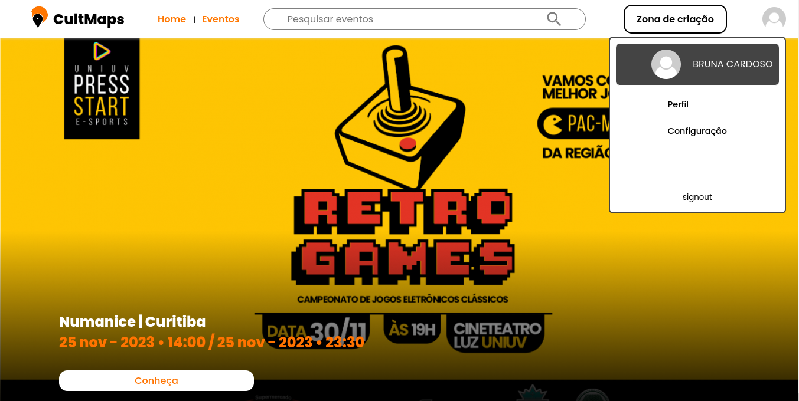

# Compartilhe Eventos

    
    

        <b>Cult Maps </b>é uma plataforma de divulgação de eventos, onde,   para ficar por dentro dos eventos mais próximo de você.
    

    

    

    

    
<b>Principais funcionalidade</b>

    <ul>
        <li>Cadastro de usuário</li>
        <li>Login</li>
        <li>Cadastro de eventos</li>
        <li>Listagem de eventos por categorias</li>
        <li>Pesquisa de eventos</li>
    </ul>
    

Colega de projeto:

- [@github/Leonan Reis](https://github.com/LeonanAraudo) 
  
- Tecnologias:
 - React js
 - Styled Component
 - Axios

Repositório para API REST:

- [@github/api-cultmaps](https://github.com/BrunaCardoso7/api-cultmaps) 

